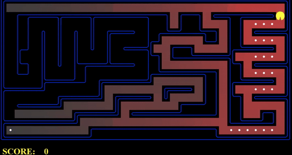

# Ai-pacman-bfs-dfs-ucs-astar
### Pacman movement for BFS DFS UCS &amp; A*


## Demo



## 1) Breadth First Search (BFS):
```
python pacman.py -l mediumMaze -p SearchAgent -a fn=bfs
python pacman.py -l bigMaze -p SearchAgent -a fn=bfs -z .5
python eightpuzzle.py
```


## 2) Depth First Search (DFS):
```
python pacman.py -l tinyMaze -p SearchAgent
python pacman.py -l mediumMaze -p SearchAgent
python pacman.py -l bigMaze -z .5 -p SearchAgent
```


## 3) Uniform Cost Search (UCS):
```
python pacman.py -l mediumMaze -p SearchAgent -a fn=ucs
python pacman.py -l mediumDottedMaze -p StayEastSearchAgent
python pacman.py -l mediumScaryMaze -p StayWestSearchAgent
```


## 4) A* search:
```
python pacman.py -l bigMaze -z .5 -p SearchAgent -a fn=astar,heuristic=manhattanHeuristic
```


## 5) Finding All the Corners:

```
python pacman.py -l tinyCorners -p SearchAgent -a fn=bfs,prob=CornersProblem
python pacman.py -l mediumCorners -p SearchAgent -a fn=bfs,prob=CornersProblem
```


## 6)  Corners Problem: Heuristic:
```
python pacman.py -l mediumCorners -p AStarCornersAgent -z 0.5
```


## 7) Eating All The Dots:
```
python pacman.py -l testSearch -p AStarFoodSearchAgent
```


## 8) Suboptimal Search:
```
python pacman.py -l bigSearch -p ClosestDotSearchAgent -z .5 
```


All the code can be seen in search.py and searchAgents.py
